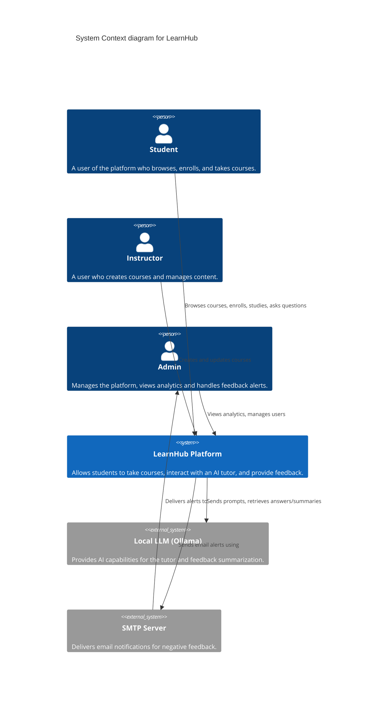
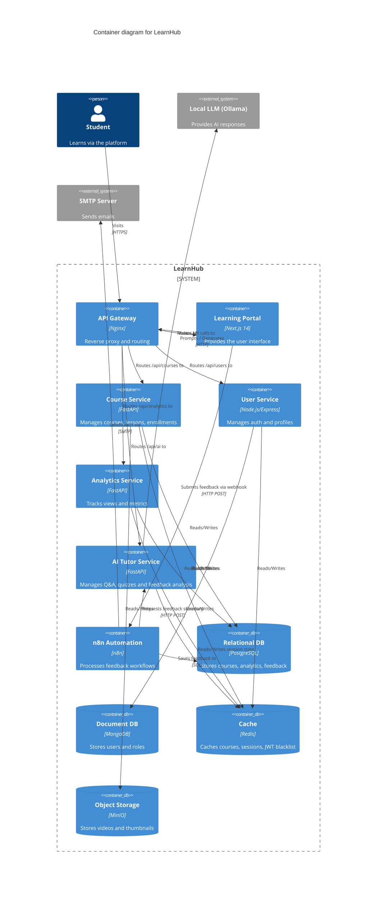
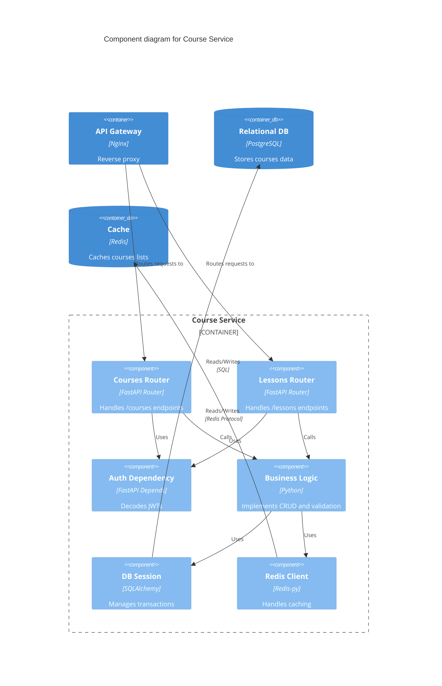
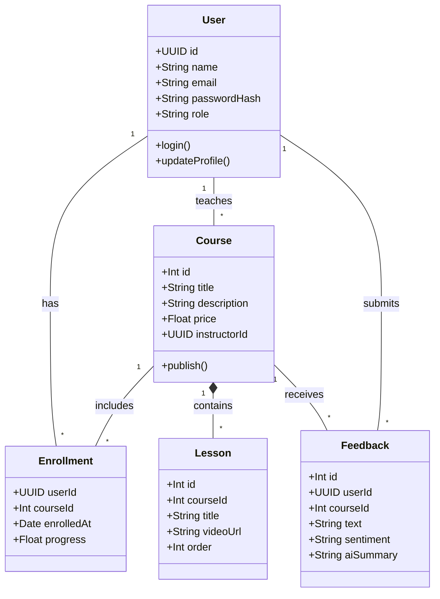
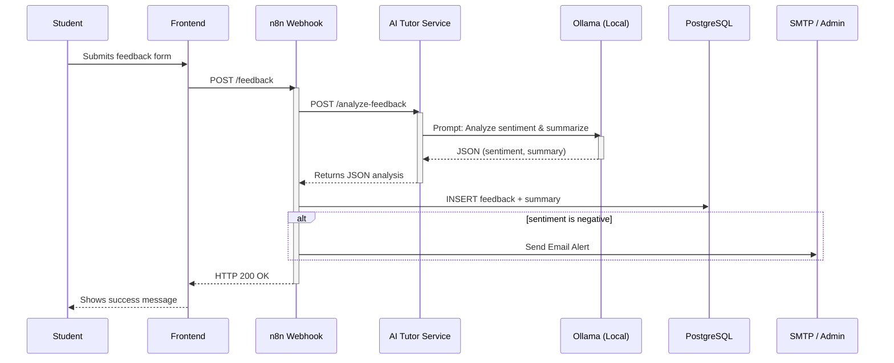

# LearnHub Architecture Diagrams

This document contains the C4 Model and UML diagrams for the LearnHub platform, as requested for the project deliverables. 
You can view these diagrams on GitHub or in any Markdown editor that supports Mermaid.js.

## 1. C4 Model Diagrams

### Level 1: Context Diagram
*This diagram shows the system in its environment, highlighting external actors and systems.*



### Level 2: Container Diagram
*This diagram breaks down the LearnHub system into its constituent containers (microservices, datastores, etc).*



### Level 3: Component Diagram (Course Service)
*This diagram zooms into the Course Service to show its internal structure.*



---

## 2. UML Diagrams

### Use Case Diagram
*Represents the interactions between the users (actors) and the platform.*

```mermaid
usecaseDiagram
    actor Student
    actor Instructor
    actor Admin

    package LearnHub {
        usecase "Browse Courses" as UC1
        usecase "Enroll in Course" as UC2
        usecase "Watch Lesson" as UC3
        usecase "Ask AI Tutor" as UC4
        usecase "Submit Feedback" as UC5
        
        usecase "Create Course" as UC6
        usecase "Manage Lessons" as UC7
        
        usecase "View Analytics" as UC8
        usecase "Manage Users" as UC9
    }

    Student --> UC1
    Student --> UC2
    Student --> UC3
    Student --> UC4
    Student --> UC5
    
    Instructor --> UC1
    Instructor --> UC6
    Instructor --> UC7
    
    Admin --> UC8
    Admin --> UC9
```

### Class Diagram
*Shows the main entities in the system and their relationships.*



### Sequence Diagram
*Illustrates the feedback submission and automation flow.*



### Deployment Diagram
*Shows how the Docker containers are deployed and networked.*

```mermaid
graph TD
    subgraph "Docker Host"
        subgraph "Frontend Network"
            NGINX[API Gateway :80]
            FRONTEND[Next.js :3000]
        </subgraph>
        
        subgraph "Backend Network"
            COURSE_SVC[Course Service :8001]
            USER_SVC[User Service :8002]
            ANALYTICS_SVC[Analytics Service :8003]
            AI_SVC[AI Tutor Service :8004]
            N8N[n8n Automation :5678]
            
            POSTGRES[(PostgreSQL :5432)]
            MONGO[(MongoDB :27017)]
            REDIS[(Redis :6379)]
            MINIO[(MinIO :9000)]
            OLLAMA[(Ollama :11434)]
        </subgraph>
        
        NGINX -->|/| FRONTEND
        NGINX -->|/api/courses| COURSE_SVC
        NGINX -->|/api/users| USER_SVC
        NGINX -->|/api/analytics| ANALYTICS_SVC
        NGINX -->|/api/ai| AI_SVC
        
        COURSE_SVC --> POSTGRES
        COURSE_SVC --> REDIS
        COURSE_SVC --> MINIO
        
        USER_SVC --> MONGO
        USER_SVC --> REDIS
        
        ANALYTICS_SVC --> POSTGRES
        ANALYTICS_SVC --> REDIS
        
        AI_SVC --> REDIS
        AI_SVC --> OLLAMA
        
        N8N --> POSTGRES
        N8N --> AI_SVC
    end
    
    Internet((Internet)) -->|HTTP/HTTPS| NGINX
```
